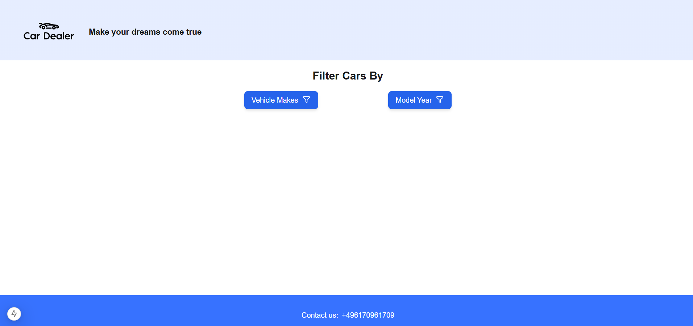
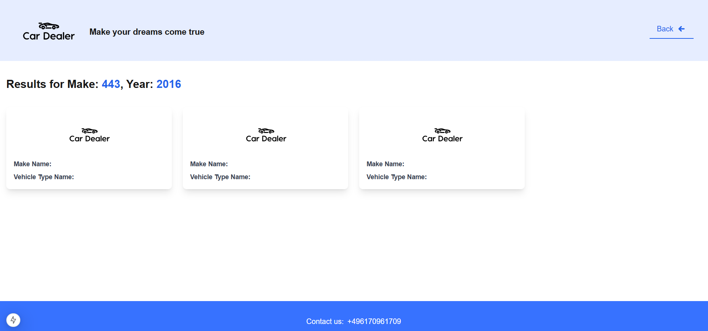

# Project Name

## 📜 Description

This web application allows you to filter cars by make name, and model year.
After applying the filters, you will be redirected to a page displaying a list of filtered cars.

## 🚀 Getting Started

### Prerequisites

Ensure you have the following installed on your system:

- [Node.js](https://nodejs.org/) (version X.X.X or later)
- [npm](https://www.npmjs.com/) or [yarn](https://yarnpkg.com/)

### 🔧 Installation

Clone the repository and install dependencies:

```sh
git https://github.com/MashkaSladkykh/car_dealer.git
cd project-name
npm install  # or yarn install
```

### 🏗️ Building the Application

To build the project, run:

```sh
npm run build  # or yarn build
```

### ▶️ Starting the Application

#### Development Mode

Run the app in development mode:

```sh
npm run dev  # or yarn dev
```

The app will be available at `http://localhost:3000/`.

#### Production Mode

To start in production mode, run:

```sh
npm run start  # or yarn start
```

## 📸 Screenshots

### Homepage



### Filter Example



## 🛠️ Useful Information

- It is required to add .env.local file and fill it like in example in `.env.example` file
